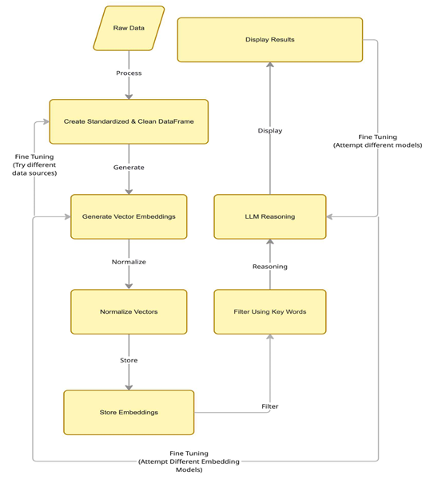
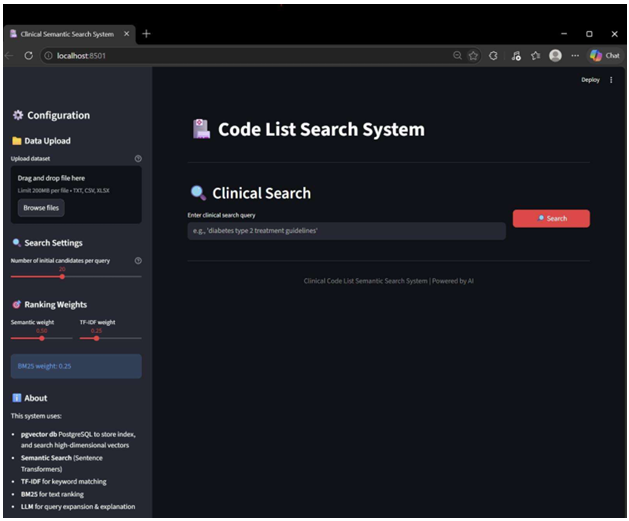
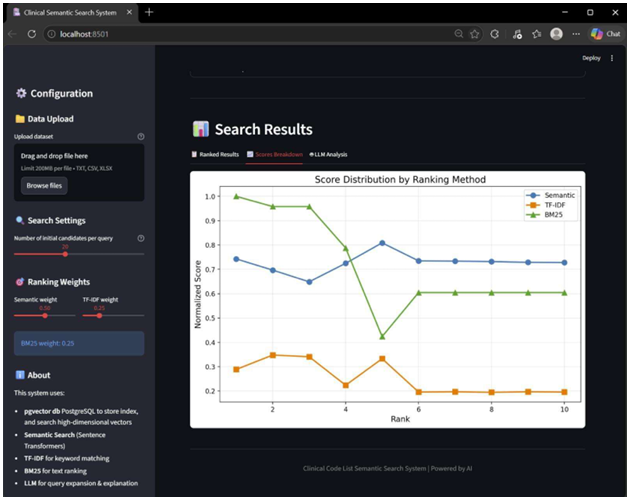
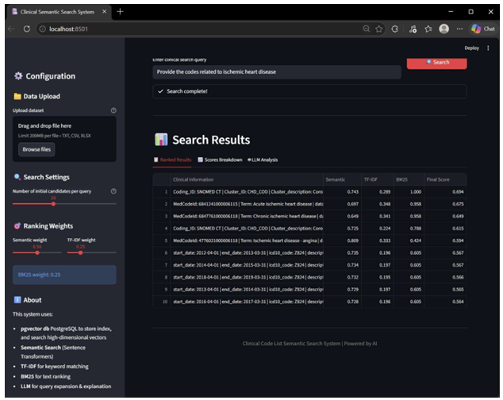

# NICE Employer Project  

## Executive Summary 
This report presents an AI-augmented framework designed to modernize the clinical code list creation 
process for the National Institute for Health and Care Excellence (NICE). Clinical code lists are a 
foundational component of evidence-based healthcare analysis, enabling the identification of patient 
cohorts from complex healthcare datasets. However, their development remains manual, time
consuming, and subject to inconsistency. 
The project addresses this challenge by designing a retrieval-based AI system that combines semantic 
understanding, hybrid ranking, and explainable outputs. The proposed solution, an agentic workbench 
built on a Retrieval-Augmented Generation (RAG) architecture, which automates code 
recommendation while maintaining transparency and clinical defensibility. 
The Problem: 
Defining clinical code sets (SNOMED/dm+d) is currently a manual and labor-intensive task.  
Key challenges include: 
- Operational Inefficiency: Manual classification across 350,000+ codes create a chronic 
operational bottleneck, delaying critical analysis by weeks. 
- Terminology Ambiguity: Inconsistent mapping of clinical intent to structured data leads to 
"noisy" patient cohorts. 
- Expert Burden: High reliance on senior clinical validation diverts critical resources from 
strategic decision-making. 
The Solution: Multi-Stage Agentic Workbench 
We propose a multi-stage Agentic Workbench leveraging a RAG system with Hybrid Search to 
automate recommendations.  
The solution is: 
- Defensible: Backed by quantified semantic similarity scores. 
- Explainable: Accompanied by AI-generated medical rationales for expert audit. 
- Scalable: Capable of processing complex evidence (RWE) at pace. 

## The Data Foundation 
A robust data foundation was established to support model development and ensure relevance to 
NICE workflows. The team explored multiple data sources, focusing on those aligned with real-world 
clinical usage, including but not limited to Web search, Python processing and Win64 Data 
Investigation Tool (specifically developed for this task, see Appendix 1).  
Key datasets include NHS 
- Oxford (OpenCodeCounts): ICD-10, OPCS-4, and SNOMED statistics from GitHub. 
- QOF business rules and expanded cluster lists. 
An automated data ingestion pipeline was developed using Python, enabling efficient extraction and 
transformation of .rda files. This pipeline performs two critical functions:  
- Validation: Filters out deprecated or inactive codes 
- Categorization: Applies regex-based semantic tagging (e.g. disorder, procedure) to improve 
retrieval precision  
This structured dataset forms the basis for embedding, retrieval, and model evaluation.  

## High Level Architecture Model  
The solution is designed as a layered retrieval and reasoning system. Clinical data is first processed and embedded into a vector database, enabling semantic search. User queries are then interpreted within this structured context, combining semantic similarity and keyword based retrieval. The final stage uses a LLM to generate ranked outputs alongside clinical explanations.

This architecture ensures accurate output, grounded in data and justified to support expert validation. Two approaches have been developed and tested. The final chosen one is described here in this 
document starting in the following section “Technical Walkthrough”. 
The alternative approach utilized both the SNOMED CT code usage dataset and the QOF Expanded 
Cluster List, which were merged into a single comprehensive data frame. To enable semantic search, 
BioBERT (specifically pretrained on biomedical and clinical text) was used to generate vector 
embeddings. These embeddings were stored and queried using FAISS, which enables efficient cosine 
similarity search across the full dataset of approximately 158,000 vectors. 
For language model reasoning, the system connected to Qwen 2.5-7B via the HuggingFace Inference 
API. A RAG layer was implemented using pre-generated DAAR clinical code lists as contextual 
reference documents, grounding the model's explanations in established coding guidance rather than 
general knowledge alone. The backend ran on Google Colab and was exposed to a Google Sheets 
frontend via a ngrok tunnel, with a Flask server handling query requests and returning ranked results 
with similarity scores and LLM-generated reasoning. 
Comparative testing was conducted between this approach and our primary approach. While the 
alternative system demonstrated strong semantic matching capabilities, the primary approach proved 
more robust and accurate when queried with specific clinical keywords and phrases.  
In the following page is explained the Multi-Stage Agentic Workbench solution chosen and proposed.

## Technical Walkthrough 
The system is developed through a four-stage pipeline: 
### Stage 1: Clinical Feature Engineering 
Technical Overview: Raw clinical descriptions are converted into highly optimized, searchable 
"Context Blocks" for the AI. 
Regex-Based Semantic Tagging: 
- Uses regular expressions to isolate "Semantic Tags" from SNOMED descriptions. 
- Allows the system to immediately distinguish between a disorder (diagnosis), finding 
(observation), or procedure (treatment). 
Unified 'Retrieval Text' Generation: 
- Merges code, term, usage frequency, dates, and data source into a single, unified string to 
provide maximum context for semantic matching.  

### Stage 2: Embedding and Vector Storage  
Clinical text is converted into embeddings using a sentence-transformer model (MiniLM). These 
embeddings are stored in a PostgreSQL database with pgvector, enabling efficient similarity-based 
search aligned with clinical intent. 
#### Technical Overview: 
Text is transformed into "Mathematical Meaning" using deep learning and 
stored in a specialized vector database. 
Deep Learning Model: uses the all-MiniLM-L6-v2 Sentence Transformer model to convert 150,000+ 
unique clinical strings into 384-dimensional embeddings. 
#### The pg-vector Database: 
- Connects to PostgreSQL with the pgvector extension enabled. 
- This enables high-speed, scalable similarity searches based on clinical intent rather than just 
keyword matching (e.g., matching "blood pressure" with "hypertension"). 
### STAGE 3: Hybrid Retrieval & Re-Ranking Logic  
To maximize retrieval accuracy, a hybrid ranking model is implemented: TRIPLE-SCORING SYSTEM: 
1. Semantic Search (50%): Vector distance in PostgreSQL via pgvector. 
2. TF-IDF (25%): Keyword importance ranking via TfidfVectorizer. 
3. BM25 (25%): Modern search engine ranking via BM25Okapi. 

Query expansion using a LLM further enhances recall by generating clinically relevant synonyms. 
The user's query is first fed into the Gemma 3 LLM, which automatically generates 5 clinical synonyms 
(e.g., generating "elevated BP" from "hypertension"), broadening the initial search reach. 
This multi-signal approach reduces the risk of missing relevant codes while improving ranking 
precision. 

### STAGE 4: RAG & Clinical Reasoning Output 
A RAG framework integrates a LLM to produce explainable outputs. Rather than returning raw code 
lists, the system generates structured justifications, linking selected codes to clinical meaning and 
usage context. 
- VISUALIZATION: Streamlit platform is used to configure a user interface. 
- RAG: The top-scoring clinical codes are fed back into Gemma 3 LLM. This grounds the AI’s response in the provided 1.6M row dataset. 
- THE DEFENSIBLE EXPLANATION: Instead of just a list of codes, the output provides a professional explanation, justifying why a code was chosen (e.g., "This SNOMED code is a high priority match because it appears in 2024 NHS usage data and aligns with NICE dyslipidaemia guidelines."). 

This ensures output is clinically interpretable and defensible, supporting expert validation. 

## RESULTS
The model was tested using a range of clinical queries, the Data Investigation Tool was first used to 
get a list of codes from all data sources, for simplicity, search term “Dyslipidemia” (see Appendix 1) 
was used, as the tool does a wildcard search in all datasets with no artificial intelligence its results 
were used to check that the model results included these codes and others to prove that the model 
contains artificial intelligence. All terms used were:  
 
1. “Dyslipidemia” 
2. “Provide the codes related to ischemic heart disease” 
3. “Hypertension” 
4. “Must investigate high blood pressure” 
5. “Verify antihypertensive medicine” 
6. “LDL” 
7. “I need to investigate pathologies related to high cholesterol” 
As example, we choose ““Provide the codes related to ischemic heart disease” and “Hypertension”.

Results demonstrate that the system can successfully retrieve clinically relevant codes and provide 
meaningful explanations aligned with clinical reasoning.

